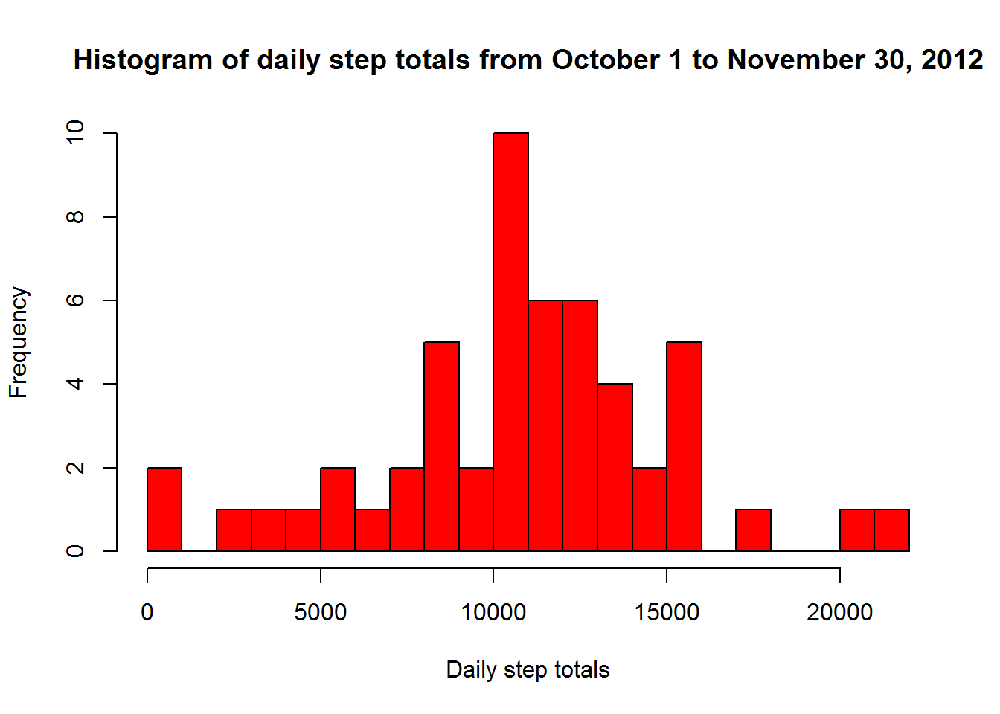
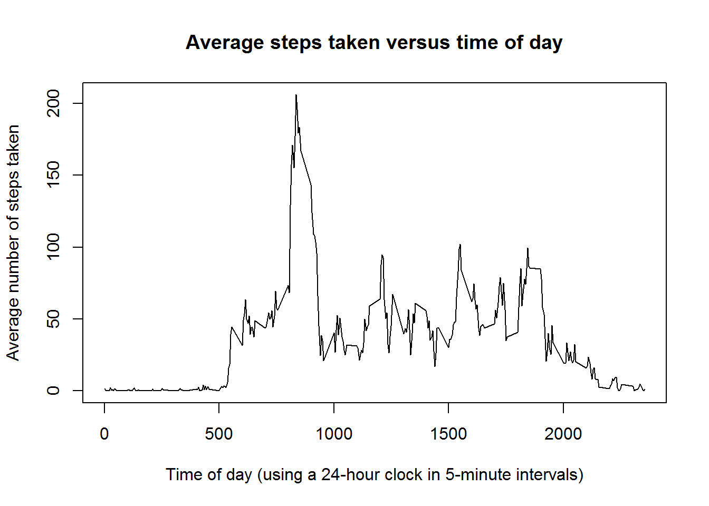
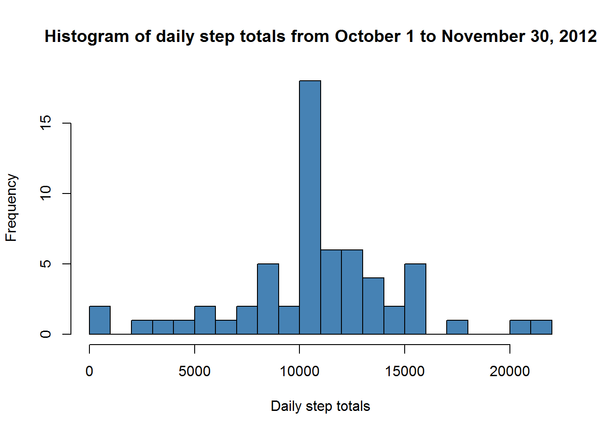

# Reproducible Research, Assignment #1


----------------------------------------

## Loading and Processing the data

We begin by loading the data and processing it into a suitable format for our needs.


```r
    ## be sure the activity.csv file is in the appropriate working directory
activity <- read.csv("activity.csv", 
                      colClasses = c("integer", "Date", "integer"))
```

----------------------------------------

## Steps taken per day

We would like to know the mean and median steps per day.  To begin, let us populate a vector of steps taken per day.


```r
### steps_by_date - a vector of total steps taken each day
### days - the number of days in our data set

activity_by_date <- split(activity, activity$date) 
days <- length(activity_by_date)
steps_by_date <- vector("integer", days) 
for (i in 1:days){
    steps_by_date[i] <- sum(activity_by_date[[i]][[1]])
}
```

We obtain the following histogram of the total number of steps taken per day:


```r
hist(steps_by_date, breaks=20, col="Red",
     xlab = "Daily step totals",
     main = "Histogram of daily step totals from October 1 to November 30, 2012")
```

 


We would like to know the mean and median of the steps taken per day.


```r
mean_steps_by_date <- mean(steps_by_date, na.rm = TRUE)
median_steps_by_date <- median(steps_by_date, na.rm = TRUE)
```

* The **mean steps** taken per day is 10766.19

* The **median steps** taken per day is 10765.

----------------------------------------

## Steps taken by time of day

What if we wanted to study the pattern of steps taken in each 5-minute time interval, averaged over the days of our data set?


```r
activity_by_time <- split(activity, activity$interval)
times <- unique(activity$interval)
steps_by_time <- vector("integer", length(times))
for (i in 1:length(times)){
    steps_by_time[i] <- mean(activity_by_time[[i]][[1]], na.rm=TRUE)
}
```

When we average each 5 minute interval over the two month period, we obtain the following graph of average steps per time interval.


```r
plot(times, steps_by_time, type="l",
     xlab = "Time of day (using a 24-hour clock in 5-minute intervals)",
     ylab = "Average number of steps taken",
     main = "Average steps taken versus time of day")
```

 


What 5 minute time period has the maximum average steps?


```r
### Find where the (first) maximum occurs in the vector of average steps
when_max <- seq(along=steps_by_time)[steps_by_time == max(steps_by_time)]

### Now find the corresponding time interval
when_max <- times[[when_max]]
```

The **maximum** for the 5-minute step averages occurs at 835.  This is consistent with what we observe in the above graph.

----------------------------------------

## Dealing with the NA fields

We begin by counting the number of NA fields in the data frame.


```r
sum(is.na(activity$steps))
```

```
## [1] 2304
```

To fill in the missing NA vlaues, we will use the mean values of that corresponding 5-minute time interval across all of the days. Our *steps_by_time* vector is already a vector of means across every 5-minute interval.


```r
### Set up a data frame with the average steps per time interval.
### The rows are assigned the time interval as a name.

average_steps <- data.frame(times, steps_by_time)
rownames(average_steps) <- average_steps[,1]

### Clone our original data frame
activity_no_NA <- activity

### This loop cycles through the steps data, looking for NA values.  Upon
### finding an NA, it notes the interval upon which it occurred (stored in
### the 'temp' variable), then replaces that value with the
### corresponding value from our average_steps data frame.

for (i in 1:length(activity_no_NA$steps)){
    if (is.na(activity_no_NA$steps[[i]])){
        temp <- activity_no_NA$interval[[i]]
        activity_no_NA$steps[[i]] <- average_steps[as.character(temp), 2]
    }
}
```

Let's confirm that we have filled in all the NA values with another count:


```r
sum(is.na(activity_no_NA$steps))
```

```
## [1] 0
```

Now compute a histogram of steps with the NA values filled in.  We will rerun the same code as before for the new data frame.


```r
### Set up the data for the histogram
activity_by_date_no_NA <- split(activity_no_NA, activity_no_NA$date) 
days <- length(activity_by_date_no_NA)
steps_by_date_no_NA <- vector("integer", days) 
for (i in 1:days){
    steps_by_date_no_NA[i] <- sum(activity_by_date_no_NA[[i]][[1]])
}

hist(steps_by_date_no_NA, breaks=20, col="Steelblue",
     xlab = "Daily step totals",
     main = "Histogram of daily step totals from October 1 to November 30, 2012")
```

 

As expected, by replacing the NA values by the mean values for that respective time interval, we observe a surge in the count around the mean in the resulting histogram.

----------------------------------------

## Weekdays versus weekend

Let us now compare the steps taken on weekdays versus weekends.  We begin by creating a weekday factor variable and appending it to the data set:


```r
activity_no_NA$weekday <- ifelse(
    weekdays(activity$date)=="Saturday" | weekdays(activity$date)=="Sunday", 
    "weekend", # If the above condition is satified
    "weekday"  # If the above condition is not satisfied
)
```

We want to graph the average steps taken versus time interval, averaged over the weekdays and weekends respectively.  To do this, we first compute the average steps taken in each time interval twice -- once averaged over the weekdays, and again averaged over the weekends.


```r
activity_weekday <- split(activity_no_NA, activity_no_NA$weekday)
weekday_by_time <- split(activity_weekday$weekday,
                        (activity_weekday$weekday)$interval)
weekend_by_time <- split(activity_weekday$weekend,
                        (activity_weekday$weekend)$interval)
weekday_steps <- vector("integer", length(times))
weekend_steps <- vector("integer", length(times))
for (i in 1:length(times)){
    weekday_steps[i] <- mean(weekday_by_time[[i]][[1]])
    weekend_steps[i] <- mean(weekend_by_time[[i]][[1]])
}
```

Let us now set up a data frame with our calculated average steps per time interval.  The third column will be a factor variable to identify whether the data refers to a weekend or a weekday input.


```r
week_frame <- data.frame(Interval = c(times, times), 
                         Steps = c(weekday_steps, weekend_steps), 
                         Weekday = factor(c(rep("weekday", length(times)),
                                     rep("weekend", length(times))))
                         )

library(lattice)
xyplot(Steps ~ Interval | Weekday, 
       data = week_frame, 
       layout = c(1,2), 
       type = "l",
       ylab = "Number of steps")
```

 
